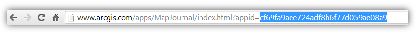

Custom Story Map Journal with time slider generated from CSV file.

This repository provides the application source code of a cutomized version of the Map Journal. This version contains a CSV file with year/info fields. This file is read by the application and controls the configured sections. These sections rely on a webmap that has a time field and a numeric data field used for calculating totals for each geometry. Such a service could be time enabled, but is not in this application. This is managed by the application.

First, create an Esri Map Journal using builder:
A Map Journal application can be created from [ArcGIS Online](http://arcgis.com), from the [Esri Story Maps website](http://storymaps.arcgis.com/) or from a [Portal for ArcGIS](http://www.esri.com/software/arcgis/arcgisserver/extensions/portal-for-arcgis) deployment. 
Use the [step-by-step tutorial](http://storymaps.arcgis.com/en/app-list/map-journal/tutorial/).
Once your story is ready, you have to find its appication ID in ArcGIS Online. The ID is a 32 character string that you will find in your web browser's address bar when you are viewing your journal.



1. Download this source as a zip file.
2. Deploy the application on your webserver. See [FAQ](#how-to-deploy-the-application-on-a-web-server) for details
3. Edit index.html, find the configuration section on line 38 and paste in your application ID
4. Navigate to index.html (e.g., `http://127.0.0.1/MapJournal/index.html`)

You can continue to use the builder in ArcGIS Online to modify your story.
See [customize the look and feel section](#customize-the-look-and-feel) or [developer guide](#developer-guide) if you want to modify the app.

The main Journal content must be created using the Map Journal builder and will live in a Web Application Item. Only the configure time slider webmaps use the CVS to populate the sections and to control the time slider. 

The orignal Map Journal's data are stored in a Web Application Item in ArcGIS Online or Portal for ArcGIS. This include the narrative content, reference to the webmap(s), reference to picture(s), video(s), web page(s) and the settings. 
The image and videos that you include in your Journal using the builder are not copied in ArcGIS Online. You have to make sure that those medias as well as the webmaps you are using are and will remain accessible to your audience.
The CSV file is located in the website's app folder when it is deployed.

All customized versions of the Esri Map Journal must be hosted on a web server and cannot be hosted on ArcGIS Online or Portal.

To edit change the version of the JavaScript API, edit `index.html` and locate `pathJSAPI` around line 75. 

How to deploy the application on a web server?
If you are not familiar with web servers here is three solutions:
 * Use a free hosting service like [Dropbox](https://www.dropbox.com), you may have to [configure Dropbox to enable webpage hosting](https://www.dropbox.com/enable_public_folder)
 * Use the web server that comes with your server Operating System. On Windows this is Internet Information Services (IIS), if you have a `C:\inetpub\wwwroot` folder on your computer, you should be able to access it's content using `http://localhost`
 * On Windows or Mac OS, use a simple web server like [Mongoose](https://code.google.com/p/mongoose/) (not recommended for production)

If you are experiencing some rendering issues like improper symbol appearing instead of icons, you will have an extra configuration to perform. Some servers require to configure a new mime type to be able to serve Map Journal fonts correctly. See the following links for more information:

 * [IIS Mime types](http://codingstill.com/2013/01/set-mime-types-for-web-fonts-in-iis/)
 * [Properly serve webfonts](http://blog.symbolset.com/properly-serve-webfonts)

Can I use a single deployment of Map Journal for multiple stories?
Yes. 
If you have customized the application and deployed it on your server, you don't need to copy it multiple times, edit index.html and paste a different application ID for each story you want to publish. 

Instead edit `index.html`, locate the `configOptions` section and fill the `authorizedOwners` property with the ArcGIS Online or Portal for ArcGIS login of the owner(s) of the Journals you want to use. This make possible for the application to display  any of the Journal created by the specified user(s) through an URL parameter.

Example of the same application displaying two stories:
 * http://myserver.com/MapJournal/index.html?appid=c7ad1a55de0247a68454a76f251225a4
 * http://myserver.com/MapJournal/index.html?appid=c7ad1a55de0247a68454a76f251225a5

Configuration
In addition to the configuration offered by the builder, the files `app/config.js` and `app/commonConfig.js` provide various settings. Documentation is provided in those files.
REQUIRED - CONFIGURE THE FOLLOWING IN CONFIG.JS
TIMESLIDERMAPS -- needs a section number (referencing the index of the section in the journal) and a webmap ID (referencing the id of the time webmap).
CSVFILES -- needs a path (app/<name of csv file>, a startYear (does not require year but must be numeric can be sequenced), a section number (referencing the index of the section in the journal) and a webmap ID (referencing the id of the time webmap).
TIME_TOTAL_FIELD -- the name of the numeric field in the webmap layer that will be used for summing the total.
TIME_YEAR_FIELD -- the name of the time field in the webmap layer that will be used for the slider and text displays.
TIME_PLAYER_MS -- milliseconds for the slider to wait.

Customize the look and feel
Custom color theme
As Map Journal doesn't yet offer the ability to create a custom theme through the builder, customizing the various colors of the application require to download and configure them through `app/config.js`.

For example if you are using a Side Panel layout and have kept the default theme, open `app/config.js`, locate the `LAYOUT` property and edit the following line with the desired colors.

```
themes: [
  {name: "side-default-1", dotNav: "#777777", panel: "#FFFFFF", media: "#EEEEEE", text: "#000000", textLink: "#555", esriLogo: "black"},
  ...
  ]
```

Other customization
Most of the look and feel customization can be done using the [regular Application Download](http://links.esri.com/storymaps/map_journal_template_zip) and including the css/html overrides directly into `index.html`. 

As the application Javascript and CSS are minified, **we don't recommend that you directely edit those files** (e.g. `app-viewer-min.css`, `app-viewer-min.js`, ...). In addition to being hard to edit, this will make application update complex for you.

If you want to change the behavior of one functionality or want to add new one, follow the [developer guide](#developer-guide) below.

The easiest way to find the id or path of a DOM element that you want to customize is to use your browser developer tool, read documentation for [Chrome](https://developers.google.com/chrome-developer-tools/), [Safari](https://developer.apple.com/library/safari/documentation/AppleApplications/Conceptual/Safari_Developer_Guide/Introduction/Introduction.html), [Firefox](https://getfirebug.com/).

Here is some customization examples that can achieved through the `style` tag already present for you in `index.html` (search for `/* CUSTOM CSS RULES */`):

#### Use an image as the background of the Side or Floating panel header

```
...
<body class="claro">
  <style>
    /* CUSTOM CSS RULES */
    .sectionPanel .header {
      background: url('http://www.esri.com/~/media/banner-map1.jpg');
    }

    .sectionPanel .appTitle {
      background: url('http://www.esri.com/~/media/banner-map1.jpg');
      background-position: 0 -50px;
    }
  </style>
...
```

Developer guide
This developer guide is intended for developers that wants to modify the behavior or add new functionalities to this custom implementation of the Map Journal application. 
It requires knowledge of HTML, Javascript and CSS languages.
If you only need to customize look and feel, you should be able to do so using the [customize section above](#customize-the-look-and-feel).

Application life cycle
The custom implementation of the Map Journal fires events that allow customization with lose integration. This mean that you don't need to understand the application internals to implement simple extension.

To try those events, look for the `Custom Javascript` block at the far end of index.html.

```
...
require(["dojo/topic"], function(topic) {
  /*
   * Custom Javascript to be executed while the application is initializing goes here
   */
   
  console.log("Map Journal is initializing");
  
  // The application is ready
  topic.subscribe("tpl-ready", function(){
    /*
     * Custom Javascript to be executed when the application is ready goes here
     */
     
    console.log("Map Journal is ready");
  });
  
  // When a section is being loaded (don't wait for the Main Stage media to be loaded) 
  topic.subscribe("story-load-section", function(index){
    console.log("The section", index, "is being loaded");
  });
  
  // After a map is loaded (when the map starts to render)	
  topic.subscribe("story-loaded-map", function(result){
    if ( result.index !== null )
      console.log("The map", result.id, "has been loaded from the section", result.index);
    else
      console.log("The map", result.id, "has been loaded from a Main Stage Action");
  });
  
  // When a main stage action that load a new media or reconfigure the current media is performed
  // Note that this even is not fired for the "Locate and address or a place action"
  topic.subscribe("story-perform-action-media", function(media){
    console.log("A Main Stage action is performed:", media);
  });
});
...
```

Developer helpers
In addition to the events described above, the story data, configuration and useful helpers functions can be accessed through the global variable `app`.

```
console.log("Section", app.data.getCurrentSectionIndex(), "/", app.data.getStoryLength());
console.log("Current map", app.map);
console.log("IDs of all the webmaps used in the story", app.data.getWebmaps());
console.log("Current section's data", app.data.getCurrentSection());
console.log("All sections data", app.data.getStorySections());
console.log("Story layout configuration", app.data.getWebAppData().get().values.settings.layoutOptions);
console.log("Static ayout configuration values", app.data.getCurrentLayoutStaticConfig());
```

Some events are also available for you to navigate the Journal programmatically:

```
require(["dojo/topic"], function(topic) { 
  // Navigate to a section
  topic.publish("story-navigate-section", 2);
  
  // Reload the content panel
  topic.publish("story-update-sections");
  
  // Update a specific section content panel
  topic.publish("story-update-section", 2);
});
```

Environment setup

Use the downloaded zip file. Unzip and build following these instructions.

To build a production version of the application from the source code, you first need to install [Node.js](http://nodejs.org/).

Then initialize the environment by running the following commands **in the MapJournal folder**:
 * `npm install`
 * `npm install –g grunt-cli`

This will create a new `node-modules` folder in your project root with all the tools required to build the application. If you have trouble running the second command, [see this documentation on how to install grunt-cli locally](https://github.com/gruntjs/grunt-cli#installing-grunt-cli-locally).

How to use the application from the source code
 * Make accessible the MapJournal folder on a web server. Use your favorite server or run one with `grunt server`, this will start a server on port `8080`
 * If using a Portal for ArcGIS instance configure the sharing url `app/config.js` (last property)
 * Use the URL parameter `appid` to specify the web item to be loaded, e.g.: http://localhost:8080/?appid=ABCD (configuring index.html > configOptions.appid is not supported in development mode)

How to build application from the source code
  * Open a terminal and navigate to the MapJournal folder 
  * Run the following command: `grunt`

The deploy folder now contains the built application that you can deploy to your web server.

Issues building the application

The build script perform code validation through [JSHint](http://www.jshint.com/), you can disable those validations by editing Gruntfile.js and look for the following comments `/* Comment out to disable code linting */`.

Design
This custom implementation of the Map Journal relies on AMD and Dojo loader [AMD](http://help.arcgis.com/en/webapi/javascript/arcgis/jshelp/#inside_dojo_amd) for application structure.

The application is structured as this:

| Path          			                  	| Contains																						|
| ---------------------------------------------	|  -------------------------------------------------------------------------------------------- |
| Gruntfile.js									| Build configuration																			|
| src/											| Main source code folder with index.html and the Eclipse project configuration							|
| src/app/										| Javascript and CSS source code 																|
| src/app/config.js			            		| App configuration file (loaded at execution time) 											|
| src/app/commonConfig.js			            | More configuration (only used when deployed outside of ArcGIS Online and Portal for ArcGIS)	|
| **src/app/storymaps/common/**						| Modules common across storymaps templates (main module is Core.js)							|
| src/app/storymaps/common/builder/				| Builder modules (main module is Builder.js)													|
| src/app/storymaps/common/mapcontrols/			| Map UI components (Overview, Legend)															|
| src/app/storymaps/common/ui/					| UI components																					|
| src/app/storymaps/common/utils/				| Utils, connector,...																			|
| src/app/storymaps/common/_resources			| Static resources																				|
| **src/app/storymaps/tpl/**						| Map Journal modules (build configuration files in the root)									|
| src/app/storymaps/tpl/builder/				| Builder modules (main module is BuilderView.js)												|
| src/app/storymaps/tpl/core/					| Core modules (main module is MainView.js) 													|
| src/app/storymaps/tpl/ui/						| UI components of the viewer grouped by target device											|
| src/lib-app/									| Dependencies (included in the final app)														|
| src/lib-build/								| Dependencies used by the build (not included in final app)									|
| src/resources/								| Static resources																				|


The main dependencies are:
 * [jQuery](http://jquery.com/)
 * [Bootstrap](http://twitter.github.com/bootstrap/)
 * [CKEditor](http://ckeditor.com/)
 * [iDangero.us Swiper](http://www.idangero.us/sliders/swiper/)

The application Javascript and CSS are minified into four files:

| File			|										|
| --------------------- | ----------------------------------------------------------------------------- |
| app/viewer-min.css	| Compressed CSS loaded when accessing the Map Journal as a viewer		|
| app/viewer-min.js	| Compressed Javascript loaded when accessing the Map Journal as a viewer	|
| app/builder-min.css	| Compressed CSS loaded when accessing the Map Journal as an author		|
| app/builder-min.js	| Compressed Javascript loaded when accessing the Map Journal as an author	|

Depending on the URL parameters, index.html will load the corresponding files.

## Licensing
Copyright 2013 Esri

Licensed under the Apache License, Version 2.0 (the "License");
you may not use this file except in compliance with the License.
You may obtain a copy of the License at

   http://www.apache.org/licenses/LICENSE-2.0

Unless required by applicable law or agreed to in writing, software
distributed under the License is distributed on an "AS IS" BASIS,
WITHOUT WARRANTIES OR CONDITIONS OF ANY KIND, either express or implied.
See the License for the specific language governing permissions and
limitations under the License.

A copy of the license is available in the repository's [LICENSE.txt](LICENSE.txt) file.

Some open-source components of this project are licensed under other License terms, see `src/lib-app/` folder for respective licence files.


